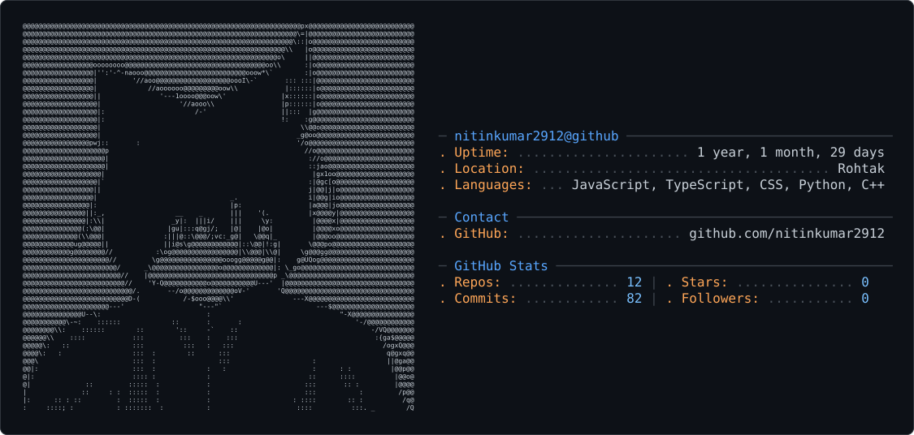

<picture>
  <source media="(prefers-color-scheme: dark)" srcset="dark_mode.svg" />
  <source media="(prefers-color-scheme: light)" srcset="light_mode.svg" />
  
</picture>

# Hey, I'm Nitin Kumar 👋

### CS Undergraduate @ DTU · Full-Stack Developer · Builder

I enjoy turning ideas into useful software and learning by building.

I'm currently focused on **full-stack development, backend engineering, and writing clean, maintainable code**.

🌐 **Portfolio:** [nitinkumar.website](https://www.nitinkumar.website/)

---

## 👨‍💻 About Me

- 🎓 Computer Science Undergraduate at **Delhi Technological University**
- 💻 Interested in **Full-Stack Development & Software Engineering**
- 🚀 Building projects that solve real-world problems
- 🌱 Currently improving my **backend, system design, and engineering skills**
- 🤝 Open to interesting projects, collaborations, and open-source contributions
- 📍 India

---

## 🛠️ Tech Stack

### Languages

### Web

### Tools

---

## 🚀 Featured Projects

### 🔎 JobTracker

A web application for managing and tracking job applications in one place.

**Focus:** Product Development · JavaScript · Web Development

[View Project →](https://github.com/nitinkumar2912/JobTracker)

---

### 🌐 Portfolio

My personal developer portfolio showcasing my projects, skills, and work.

**Focus:** TypeScript · Frontend Development

[View Project →](https://github.com/nitinkumar2912/portfolio)

---

### ✅ TopTodo

A simple productivity-focused task management application.

**Focus:** JavaScript · Web Development

[View Project →](https://github.com/nitinkumar2912/TopTodo)

---

## 📈 What I'm Working On

I'm currently focused on becoming a stronger software engineer by:

- Building production-quality applications
- Improving my backend development skills
- Learning system design and software architecture
- Writing cleaner and more maintainable code
- Contributing to open source
- Exploring new technologies through real projects

---

## 🎯 2026 Goals

- 🚀 Build and ship more production-ready projects
- 🌐 Make meaningful open-source contributions
- 🧠 Strengthen DSA and computer science fundamentals
- ⚙️ Learn more about backend engineering and system design
- 🤝 Collaborate with other developers
- 📚 Keep learning and building consistently

---

## 🤝 Let's Connect

🌐 [Portfolio](https://www.nitinkumar.website/)  
💻 [GitHub](https://github.com/nitinkumar2912)

---

### 💡 Build. Learn. Ship. Repeat. 🚀
